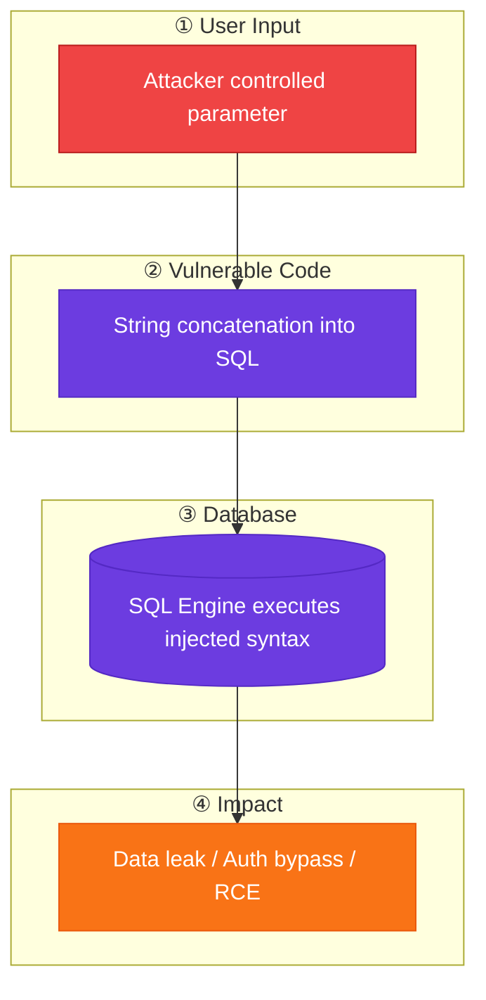
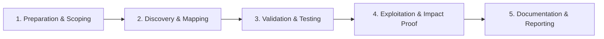

# SQL Injection

Classic SQL injection across query types and database engines.

## Overview Diagram

Visual summary of the **attack/data flow** and the **five-phase testing workflow** for this topic.

### Attack / Data Flow

<div class="sr-diagram" markdown="1">



</div>

### Testing Workflow

<div class="sr-diagram sr-diagram-methodology" markdown="1">



</div>

## How It Works

SQL injection occurs when application code concatenates untrusted input into SQL queries instead of using parameterized queries or a safe query builder. The database interpreter then executes attacker-controlled syntax as part of the query.

Common injection points include URL parameters (`?id=1`), POST body fields, HTTP headers used in lookups (cookies, `X-Forwarded-For`), and JSON/XML fields that are mapped to database queries. Vulnerabilities appear in login forms, search boxes, reporting filters, and hidden API parameters.

Injection types vary by context:

- **In-band (union-based)**: Results appear directly in the HTTP response.
- **Error-based**: Verbose SQL errors leak schema or data.
- **Boolean blind**: True/false conditions change page behavior without visible errors.
- **Time-based blind**: Delays (`SLEEP`, `WAITFOR DELAY`) confirm injection when no other oracle exists.
- **Stacked queries**: Multiple statements execute if the driver allows (`; DROP TABLE--`).

The root cause is treating structured query language as a string template. Escaping alone is fragile; parameter binding separates data from code at the protocol level.

## Exploitation

**Reconnaissance and confirmation**

1. Probe with a single quote (`'`) and look for errors or behavior changes.
2. Test boolean pairs: `' AND 1=1--` vs `' AND 1=2--`.
3. Use time delays for blind cases: `'; WAITFOR DELAY '0:0:5'--` (SQL Server) or `' OR SLEEP(5)--` (MySQL).

**Union-based extraction**

Determine column count with `ORDER BY` or `UNION SELECT NULL,NULL,...`. Match data types per column, then extract:

```sql
' UNION SELECT username,password FROM users--
```

**Automation**

```bash
sqlmap -u "https://target.com/item?id=1" --batch --level=3
sqlmap -r request.txt --batch --dbs
```

**Attack flow**

```
User input → unsanitized string concat → DB executes attacker SQL → data leak / auth bypass / RCE (xp_cmdshell, INTO OUTFILE)
```

**High-impact paths**

- Authentication bypass: `' OR '1'='1'--`
- Read arbitrary tables via `UNION SELECT`
- Write webshells when `FILE` privilege exists (MySQL `INTO OUTFILE`)
- OS command execution on MSSQL with `xp_cmdshell` when enabled

## Defense & Mitigation

**Primary fix**: Use parameterized queries (prepared statements) for every query path. In Java use `PreparedStatement`; in Python use bound parameters with DB-API drivers; in PHP prefer PDO with bound parameters—not `mysql_query` concatenation.

**Defense in depth**

- **Least privilege**: Application DB accounts should not have `FILE`, `xp_cmdshell`, or DDL rights.
- **Input validation**: Allow-lists for enums and numeric IDs; reject unexpected characters where binding is not used.
- **Error handling**: Return generic errors to clients; log details server-side only.
- **ORM discipline**: Avoid raw SQL fragments; audit `nativeQuery` and dynamic `WHERE` builders.
- **WAF**: Can block obvious payloads but is not a substitute for secure coding.

**Verification**

- Code review all database access layers.
- DAST/SAST plus manual testing on every input vector.
- Regression tests with malicious strings in CI for critical endpoints.

## Pro Tips

Practical advice from real engagements — use these to test faster and report better.

!!! tip "Start with polyglot probes"
    Try `'`, `"`, `')`, and `';` on every parameter — errors often reveal DB type immediately.

!!! tip "Use sqlmap tamper scripts"
    When WAF blocks payloads: `--tamper=space2comment,between` and lower `--level` first, then increase.

!!! tip "Test JSON APIs"
    SQLi lives in `{"id": "1'"}` bodies — Burp Intruder JSON payloads are often missed by scanners.

!!! tip "Union column discovery"
    Use `ORDER BY 1000--` and binary search down — faster than guessing NULL count.

!!! warning "Report minimally"
    One table name + one row beats a full dump — programs reward proof, not data hoarding.

## Quick Commands

```bash
# Automated detection
sqlmap -u "https://target.com/product?id=1" --batch --level=3

# From Burp request file
sqlmap -r request.txt --batch --dbs
```

!!! tip "Full Tool Guide"
    See the [Tools Guide](../../TOOLS_GUIDE.md) for install instructions, all flags, and pro tips.

## Testing Methodology

Work through each phase in order. Every step has a checkbox — complete them all for thorough, reproducible coverage.

### Phase 1 — Preparation & Scoping

- [ ] Confirm target is in program scope and ROE allows this test type
- [ ] Set up isolated lab or proxy (Burp/ZAP) with scope filters
- [ ] Document baseline application behavior and account roles
- [ ] Identify test accounts for each privilege level
- [ ] Inventory all parameters, headers, and JSON fields hitting the database

### Phase 2 — Discovery & Mapping

- [ ] Map every endpoint that queries a database (forms, APIs, search, filters)
- [ ] Inject probe characters: `'`, `"`, `)`, `;` and observe errors or diffs
- [ ] Test GET, POST, JSON body, cookies, and custom headers
- [ ] Identify ORM vs raw SQL usage via error messages or stack traces

### Phase 3 — Validation & Testing

- [ ] Confirm with boolean pairs: `' AND 1=1--` vs `' AND 1=2--`
- [ ] Determine injection type: error, union, boolean blind, time blind, stacked
- [ ] For UNION: find column count via `ORDER BY n` or `UNION SELECT NULL,...`
- [ ] Validate time-based with `SLEEP(5)` / `WAITFOR DELAY` and measure response

### Phase 4 — Exploitation & Impact Proof

- [ ] Extract minimal proof: one row, table name, or auth bypass
- [ ] Avoid dumping full databases unless explicitly authorized
- [ ] Test write primitives (`INTO OUTFILE`, stacked queries) only in lab
- [ ] Chain to RCE only when in scope and with written approval

### Phase 5 — Documentation & Reporting

- [ ] Write step-by-step reproduction with HTTP requests/responses
- [ ] Capture screenshots or video showing impact (redact sensitive data)
- [ ] Rate severity using program CVSS or impact matrix
- [ ] Provide concrete remediation guidance for developers
- [ ] Retest after fix if program allows verification
- [ ] Note database type, injection context, and parameterized query fix

## Tools

| Tool | Usage |
|------|-------|
| `sqlmap` | [Automated SQL injection](../../TOOLS_GUIDE.md#sqlmap) |
| `burp` | [Intercept, repeater & scanner](../../TOOLS_GUIDE.md#burp-suite) |
| `ghauri` | [SQL injection tool](../../TOOLS_GUIDE.md#ghauri) |

## Example Payloads

```
' OR '1'='1
' OR '1'='1'--
" OR "1"="1
1' ORDER BY 1--
1' UNION SELECT NULL--
'; WAITFOR DELAY '0:0:5'--
```

## Resources

- [PortSwigger SQLi](https://portswigger.net/web-security/sql-injection)

## Verification Checklist

- [ ] Review scope and rules of engagement
- [ ] Document baseline behavior
- [ ] Test edge cases and parser differentials
- [ ] Capture proof-of-concept safely
- [ ] Write remediation guidance
