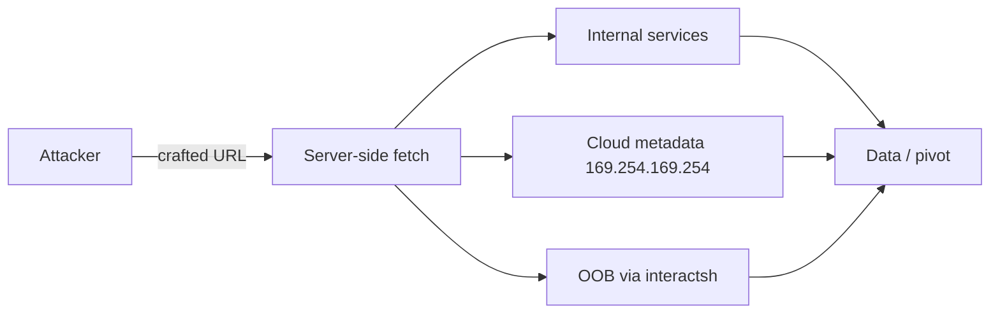
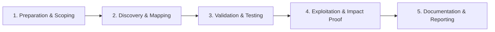

# Server-Side Request Forgery (SSRF)

Force server-side requests to internal and cloud metadata endpoints.

## Overview Diagram

Visual summary of the **attack/data flow** and the **five-phase testing workflow** for this topic.

### Attack / Data Flow

<div class="sr-diagram" markdown="1">



</div>

### Testing Workflow

<div class="sr-diagram sr-diagram-methodology" markdown="1">



</div>

## How It Works

Server-Side Request Forgery (SSRF) abuses server-side functionality that fetches or connects to URLs supplied by users. The attacker's goal is to make the **server** request resources the attacker cannot reach directly—internal services, cloud metadata endpoints, or restricted admin interfaces.

Typical features at risk:

- Image/document import from URL
- Webhook URL configuration
- PDF generators fetching HTML
- Link preview/unfurl
- SSO or OIDC discovery URL fetch
- Server-side crawlers and health checks

Cloud metadata is a classic target:

- AWS: `http://169.254.169.254/latest/meta-data/iam/security-credentials/`
- GCP/Azure: similar link-local metadata services

The server often sits inside a trust boundary with access to internal APIs (`http://127.0.0.1:8080/admin`), Redis, Elasticsearch, or Kubernetes API—none of which should be exposed to the internet.

## Exploitation

**Discovery**

1. Find parameters accepting URLs: `url`, `src`, `redirect`, `callback`, `feed`, `path`.
2. Submit `http://your-collaborator.burpcollaborator.net` and observe DNS/HTTP callbacks.
3. Probe internal hosts: `http://127.0.0.1`, `http://10.0.0.1`, `http://192.168.1.1`.

**Bypass filters**

- Alternative IP representations: `2130706433` (decimal), `0x7f000001`, `127.1`
- DNS rebinding: domain resolves to public IP first, then internal
- Redirect chains: attacker URL redirects to `http://169.254.169.254/`
- URL schemes: `file:///etc/passwd`, `gopher://`, `dict://` (when supported)

**Attack flow**

```
Attacker supplies URL → server fetches it → internal/metadata response returned or used server-side → credential theft / port scan / RCE via internal admin
```

**Cloud credential theft**

```bash
curl http://169.254.169.254/latest/meta-data/iam/security-credentials/ROLE_NAME
```

**Escalation**

- Scan internal ports via response timing or error messages
- Hit Redis `http://127.0.0.1:6379` with crafted paths (protocol smuggling contexts)
- Chain with XXE or deserialization on internal services only reachable from the app server

## Defense & Mitigation

**Network controls**

- Deny egress from application servers to link-local and internal ranges except explicitly required destinations.
- Use metadata service v2 (IMDSv2 on AWS) requiring session tokens and hop limits.

**Application controls**

- Allow-list destinations (specific partner domains) instead of block-lists.
- Resolve hostnames and validate resolved IP is not private/link-local before connecting.
- Disable redirects or re-validate each hop in a redirect chain.
- Strip or ignore dangerous URL schemes; use `https` only where possible.

**Architecture**

- Separate fetch workers in isolated network segments with no cloud metadata access.
- Do not return raw internal responses to users; summarize or proxy through strict parsers.

**Monitoring**

- Alert on requests to metadata IPs, `localhost`, and RFC1918 ranges from app tiers.

## Pro Tips

Practical advice from real engagements — use these to test faster and report better.

!!! tip "Collaborator first"
    Always confirm with Burp Collaborator or interactsh before internal scanning.

!!! tip "DNS rebinding"
    When IP filters block `127.0.0.1`, use a rebinding service or `localtest.me` variants.

!!! tip "Cloud metadata paths"
    AWS: `http://169.254.169.254/latest/meta-data/iam/security-credentials/` — try IMDSv2 token header too.

!!! tip "Gopher for Redis"
    If port 6379 is open internally, gopher payloads can write SSH keys — lab only.

!!! tip "Blind SSRF timing"
    Compare response times for open vs closed ports when no body reflection exists.

## Testing Methodology

Work through each phase in order. Every step has a checkbox — complete them all for thorough, reproducible coverage.

### Phase 1 — Preparation & Scoping

- [ ] Confirm target is in program scope and ROE allows this test type
- [ ] Set up isolated lab or proxy (Burp/ZAP) with scope filters
- [ ] Document baseline application behavior and account roles
- [ ] Identify test accounts for each privilege level
- [ ] List all server-side URL fetch features (webhooks, importers, previews)

### Phase 2 — Discovery & Mapping

- [ ] Find parameters accepting URLs: `url=`, `path=`, `webhook`, `avatar`, `import`
- [ ] Review PDF generators, image processors, and link preview features
- [ ] Check cloud metadata endpoints as internal targets
- [ ] Map allowed protocols: http, https, file, gopher, dict

### Phase 3 — Validation & Testing

- [ ] Point URL to Burp Collaborator / interactsh and confirm callback
- [ ] Test internal IPs: `127.0.0.1`, `169.254.169.254`, `10.0.0.0/8`
- [ ] Bypass filters with DNS rebinding, decimal IP, IPv6, or redirects
- [ ] Validate blind SSRF via timing and OOB DNS/HTTP

### Phase 4 — Exploitation & Impact Proof

- [ ] Read cloud metadata credentials (if in scope)
- [ ] Access internal admin panels or Redis/Elasticsearch
- [ ] Demonstrate port scan of internal network via response timing
- [ ] Stop at proof — avoid destructive internal actions

### Phase 5 — Documentation & Reporting

- [ ] Write step-by-step reproduction with HTTP requests/responses
- [ ] Capture screenshots or video showing impact (redact sensitive data)
- [ ] Rate severity using program CVSS or impact matrix
- [ ] Provide concrete remediation guidance for developers
- [ ] Retest after fix if program allows verification
- [ ] Include bypass technique and network segmentation recommendation

## Tools

| Tool | Usage |
|------|-------|
| `burp` | [Intercept, repeater & scanner](../../TOOLS_GUIDE.md#burp-suite) |
| `ssrfmap` | [SSRF exploitation](../../TOOLS_GUIDE.md#ssrfmap) |
| `interactsh` | [Out-of-band interaction server](../../TOOLS_GUIDE.md#interactsh) |

## Resources

- [PortSwigger SSRF](https://portswigger.net/web-security/ssrf)

## Verification Checklist

- [ ] Review scope and rules of engagement
- [ ] Document baseline behavior
- [ ] Test edge cases and parser differentials
- [ ] Capture proof-of-concept safely
- [ ] Write remediation guidance
