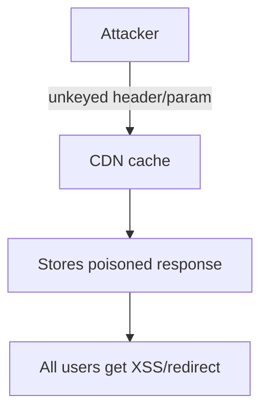

# Web Cache Poisoning

Poison shared caches to serve malicious content.

## Overview Diagram

<div class="sr-diagram" markdown="1">



</div>

## How It Works

Web cache poisoning stores a malicious response in a shared cache (CDN, reverse proxy) so subsequent users receive attacker-controlled content from the cache key the poisoner triggered.

Caches key responses on URL path, host, and selected headers—but often **ignore** unkeyed inputs:

- `X-Forwarded-Host`, `X-Original-URL`, `X-Rewrite-URL`
- `Accept-Language`, `Accept-Encoding` (fat GET)
- Query parameters stripped by cache but processed by app

If the application reflects an unkeyed header in HTML (e.g., in `<link href="...">` built from `X-Forwarded-Host`), attacker poisons cache entry for a popular URL with XSS or malicious script include.

**Cache deception** (related): trick cache into storing private responses under public URLs using path confusion (`/static/app.js/..%2fprofile`).

## Exploitation

**Find unkeyed inputs**

- Param Miner (Burp) identifies headers/parameters not in cache key but affecting response.
- Compare responses with varied `X-Forwarded-Host` values.

**Poisoning POC**

```http
GET /popular-page HTTP/1.1
Host: target.com
X-Forwarded-Host: evil.com
```

If response body includes `https://evil.com/...` and `Cache-Control` allows caching, verify with cache buster then clean request from another IP:

```http
GET /popular-page HTTP/1.1
Host: target.com
```

Victim receives poisoned body from edge cache.

**Attack flow**

```
Attacker sends crafted request → origin reflects unkeyed input → cache stores malicious response → victims load poisoned page from CDN
```

**Impact**

- Mass XSS without per-victim targeting
- Phishing content on legitimate domain
- SEO spam injection

**Tools**

- Web Cache Vulnerability Scanner, Burp Param Miner

## Defense & Mitigation

**Cache design**

- Key on all inputs that affect response body and `Vary` headers appropriately.
- Do not reflect host/header values without validation; use configured canonical hostnames.

**Caching policy**

- `Cache-Control: private` or `no-store` on dynamic and authenticated pages.
- Separate cache partitions for authenticated vs anonymous content.

**Header hygiene**

- Strip or overwrite `X-Forwarded-*` at trusted edge only; ignore client-supplied values on origin.
- Normalize URLs at single tier.

**Testing**

- Regular cache poisoning assessments on CDN config + app behavior.
- Monitor cache HIT responses for unexpected external domains in HTML.

**WAF/CDN features**

- Some providers offer cache poisoning protection rules—enable and tune.

## Methodology

- [ ] Identify unkeyed headers and parameters
- [ ] Test cacheable responses
- [ ] Confirm poisoning with unique cache keys
- [ ] Assess victim impact on CDN edges

## Tools

| Tool | Usage |
|------|-------|
| `burp` | [Intercept, repeater & scanner](../../TOOLS_GUIDE.md#burp-suite) |
| `param-miner` | [Hidden parameter discovery](../../TOOLS_GUIDE.md#param-miner) |
| `web-cache-vulnerability-scanner` | [Cache poisoning scanner](../../TOOLS_GUIDE.md#web-cache-vulnerability-scanner) |

## Resources

- [PortSwigger Web Cache Poisoning](https://portswigger.net/web-security/web-cache-poisoning)

## Verification Checklist

- [ ] Review scope and rules of engagement
- [ ] Document baseline behavior
- [ ] Test edge cases and parser differentials
- [ ] Capture proof-of-concept safely
- [ ] Write remediation guidance
