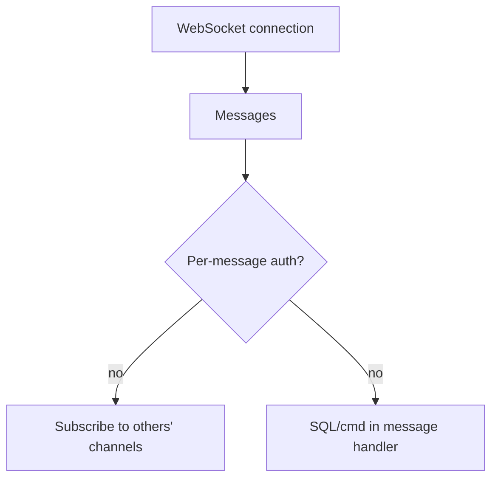
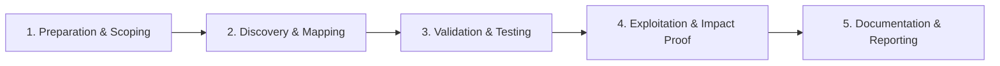

# WebSockets Security

Test real-time channels for auth bypass and injection.

## Overview Diagram

Visual summary of the **attack/data flow** and the **five-phase testing workflow** for this topic.

### Attack / Data Flow

<div class="sr-diagram" markdown="1">



</div>

### Testing Workflow

<div class="sr-diagram sr-diagram-methodology" markdown="1">



</div>

## How It Works

WebSockets provide full-duplex channels over a long-lived connection, often after an HTTP upgrade handshake. Security issues mirror HTTP but are frequently overlooked: weak origin checks, missing auth on messages, injection into handlers, and trust in client-sent event types.

Handshake request includes `Origin` header—servers should validate it like CORS. After upgrade, many apps authenticate only at connection time or assume room membership from client-supplied `roomId` messages.

Message formats (JSON RPC, GraphQL subscriptions, STOMP) may route to SQL queries, shell commands, or broadcast to other users without per-message authorization.

Unlike REST, WebSocket traffic may bypass some WAF rules; testers must capture frames in Burp or `wscat`.

## Exploitation

**Handshake tests**

1. Replay handshake with `Origin: https://evil.com`—connection accepted?
2. Connect without session cookie vs with victim cookie from another context.

**Message fuzzing**

```json
{"type": "subscribe", "channel": "admin.notifications"}
{"type": "message", "room": "private-user-123", "text": "<script>..."}
```

**Injection**

If server embeds message text into SQL or system calls without sanitization—same as HTTP injection via WS transport.

**Attack flow**

```
Malicious origin or stolen session → WS connection → unauthorized subscribe/send → data leak / XSS to other users / command execution
```

**Tools**

- Burp WebSocket history, `wscat -c wss://target.com/socket`
- Custom Python `websockets` client for parallel fuzzing

**Cross-user impact**

- Broadcast spoofing: send events appearing from other users if server trusts client `userId` field

## Defense & Mitigation

**Handshake**

- Validate `Origin` against allow-list before `101 Switching Protocols`.
- Require auth cookie or token at upgrade; bind connection to user server-side.

**Per-message authorization**

- Re-check permissions on every subscribe/send handler.
- Never trust client `userId`; derive from authenticated session.

**Input validation**

- Schema validate message types and fields; reject unknown `type` values.
- Encode output to other clients to prevent stored WS XSS.

**Rate limiting**

- Connection and message rate limits per user/IP.
- Maximum message size limits.

**Monitoring**

- Log anomalous subscription patterns (many private channels).
- Terminate idle connections; heartbeat with timeout.

## Pro Tips

Practical advice from real engagements — use these to test faster and report better.

!!! tip "Origin header"
    Connect with `Origin: https://evil.com` — many servers skip validation.

!!! tip "Replay after handshake"
    Auth at handshake only? Send messages without re-auth.

!!! tip "Subscribe to rooms"
    Join `user-123-notifications` channel without membership check.

!!! tip "ws-harness in Burp"
    Extension replays and fuzzes WebSocket messages.

!!! tip "SQLi in WS messages"
    Message handlers often lack sanitization — test JSON fields.

## Testing Methodology

Work through each phase in order. Every step has a checkbox — complete them all for thorough, reproducible coverage.

### Phase 1 — Preparation & Scoping

- [ ] Confirm target is in program scope and ROE allows this test type
- [ ] Set up isolated lab or proxy (Burp/ZAP) with scope filters
- [ ] Document baseline application behavior and account roles
- [ ] Identify test accounts for each privilege level
- [ ] Capture WebSocket handshake and message format in Burp

### Phase 2 — Discovery & Mapping

- [ ] Map subscribe/send message types and channels
- [ ] Test missing Origin validation on handshake
- [ ] Review auth token placement: cookie vs message
- [ ] Identify sensitive broadcast channels

### Phase 3 — Validation & Testing

- [ ] Connect from unauthorized Origin header
- [ ] Subscribe to other users' rooms without permission
- [ ] Inject SQL/commands in message handlers
- [ ] Fuzz message JSON fields for injection

### Phase 4 — Exploitation & Impact Proof

- [ ] Receive another user's messages or send as victim
- [ ] Demonstrate XSS via WebSocket-reflected content
- [ ] Document message schema and auth gap
- [ ] Use two test sessions for proof

### Phase 5 — Documentation & Reporting

- [ ] Write step-by-step reproduction with HTTP requests/responses
- [ ] Capture screenshots or video showing impact (redact sensitive data)
- [ ] Rate severity using program CVSS or impact matrix
- [ ] Provide concrete remediation guidance for developers
- [ ] Retest after fix if program allows verification
- [ ] Validate Origin, authenticate per message, authorize channels

## Tools

| Tool | Usage |
|------|-------|
| `burp` | [Intercept, repeater & scanner](../../TOOLS_GUIDE.md#burp-suite) |
| `ws-harness` | [WebSocket testing](../../TOOLS_GUIDE.md#ws-harness) |
| `owasp zap` | [Open-source web scanner](../../TOOLS_GUIDE.md#owasp-zap) |

## Resources

- [PortSwigger WebSockets](https://portswigger.net/web-security/websockets)

## Verification Checklist

- [ ] Review scope and rules of engagement
- [ ] Document baseline behavior
- [ ] Test edge cases and parser differentials
- [ ] Capture proof-of-concept safely
- [ ] Write remediation guidance
