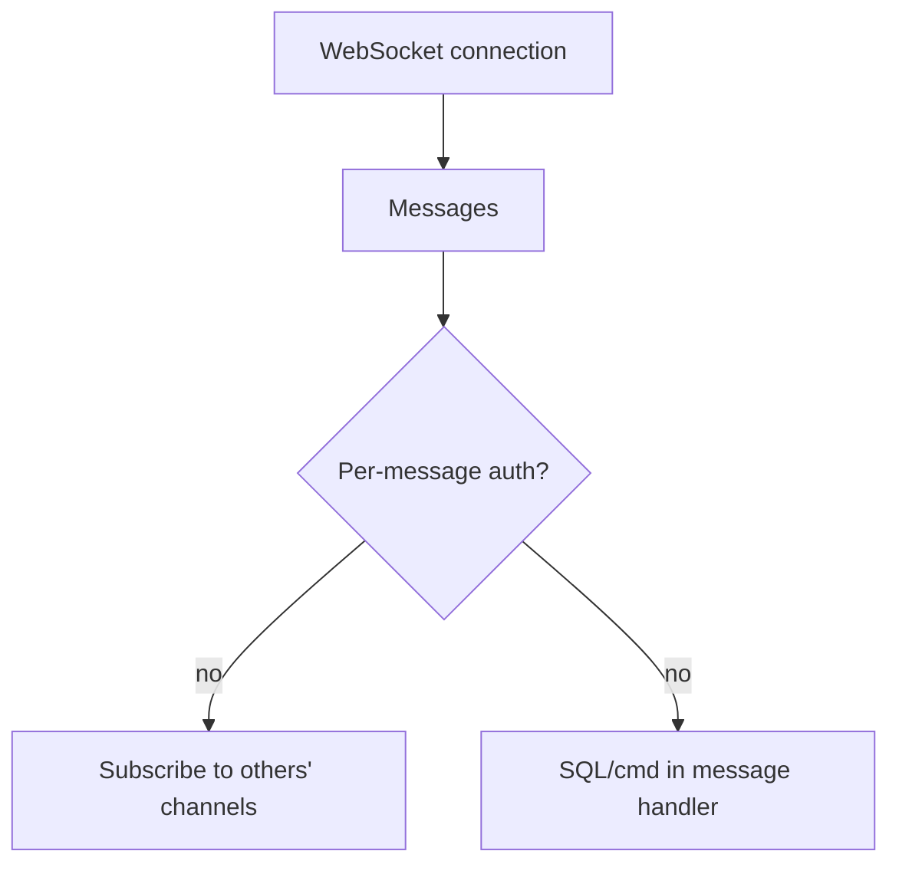

# WebSockets Security

Test real-time channels for auth bypass and injection.

## Overview Diagram

<div class="sr-diagram" markdown="1">



</div>

## How It Works

WebSockets provide full-duplex channels over a long-lived connection, often after an HTTP upgrade handshake. Security issues mirror HTTP but are frequently overlooked: weak origin checks, missing auth on messages, injection into handlers, and trust in client-sent event types.

Handshake request includes `Origin` header—servers should validate it like CORS. After upgrade, many apps authenticate only at connection time or assume room membership from client-supplied `roomId` messages.

Message formats (JSON RPC, GraphQL subscriptions, STOMP) may route to SQL queries, shell commands, or broadcast to other users without per-message authorization.

Unlike REST, WebSocket traffic may bypass some WAF rules; testers must capture frames in Burp or `wscat`.

## Exploitation

**Handshake tests**

1. Replay handshake with `Origin: https://evil.com`—connection accepted?
2. Connect without session cookie vs with victim cookie from another context.

**Message fuzzing**

```json
{"type": "subscribe", "channel": "admin.notifications"}
{"type": "message", "room": "private-user-123", "text": "<script>..."}
```

**Injection**

If server embeds message text into SQL or system calls without sanitization—same as HTTP injection via WS transport.

**Attack flow**

```
Malicious origin or stolen session → WS connection → unauthorized subscribe/send → data leak / XSS to other users / command execution
```

**Tools**

- Burp WebSocket history, `wscat -c wss://target.com/socket`
- Custom Python `websockets` client for parallel fuzzing

**Cross-user impact**

- Broadcast spoofing: send events appearing from other users if server trusts client `userId` field

## Defense & Mitigation

**Handshake**

- Validate `Origin` against allow-list before `101 Switching Protocols`.
- Require auth cookie or token at upgrade; bind connection to user server-side.

**Per-message authorization**

- Re-check permissions on every subscribe/send handler.
- Never trust client `userId`; derive from authenticated session.

**Input validation**

- Schema validate message types and fields; reject unknown `type` values.
- Encode output to other clients to prevent stored WS XSS.

**Rate limiting**

- Connection and message rate limits per user/IP.
- Maximum message size limits.

**Monitoring**

- Log anomalous subscription patterns (many private channels).
- Terminate idle connections; heartbeat with timeout.

## Methodology

- [ ] Capture WebSocket handshake and messages
- [ ] Test origin validation on the handshake
- [ ] Fuzz message types for injection
- [ ] Check authorization per channel or room

## Tools

| Tool | Usage |
|------|-------|
| `burp` | [Intercept, repeater & scanner](../../TOOLS_GUIDE.md#burp-suite) |
| `ws-harness` | [WebSocket testing](../../TOOLS_GUIDE.md#ws-harness) |
| `owasp zap` | [Open-source web scanner](../../TOOLS_GUIDE.md#owasp-zap) |

## Resources

- [PortSwigger WebSockets](https://portswigger.net/web-security/websockets)

## Verification Checklist

- [ ] Review scope and rules of engagement
- [ ] Document baseline behavior
- [ ] Test edge cases and parser differentials
- [ ] Capture proof-of-concept safely
- [ ] Write remediation guidance
