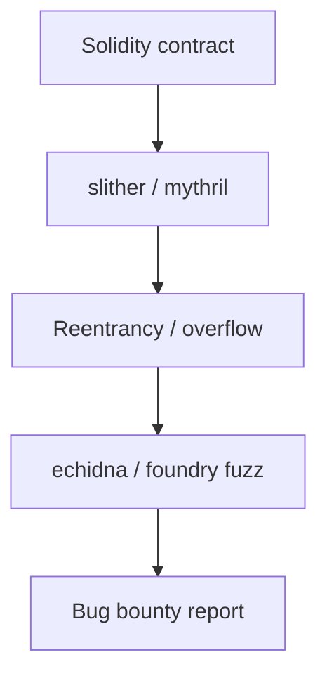

# Smart Contract Auditing

Review Solidity and EVM contracts for common vulnerabilities.

## Overview Diagram

## How It Works

**Smart contracts** are immutable (or upgradeable) programs on blockchains—primarily EVM (Solidity) and Solana (Rust). They hold tokens, enforce DeFi logic, and govern DAOs. Bugs cause direct financial loss with no recourse: reentrancy, integer overflow (pre-0.8), access control failures, oracle manipulation, and flash loan attacks.

Contracts interact via external calls; composability means vulnerabilities chain across protocols.

## Exploitation

1. **Static analysis**: Slither, Mythril for reentrancy, unchecked sends, tx.origin auth.
2. **Manual review**: trace `call`/`delegatecall`, modifier coverage, initialization functions.
3. **Fuzzing**: Echidna property tests (`echidna-test`) for invariant violations.
4. **Foundry/Hardhat tests**: fork mainnet state; simulate attacks with flash loans.
5. **Oracle checks**: spot price from single DEX pool vs Chainlink aggregators.
6. **Upgradeability**: proxy admin keys, uninitialized implementation contracts.

Report via Immunefi or protocol bug bounty; never exploit mainnet without authorization.

## Defense & Mitigation

- Follow **checks-effects-interactions**; use ReentrancyGuard on external calls.
- Use Solidity 0.8+ built-in overflow checks; explicit casting with care.
- **Least privilege**: Ownable/AccessControl on every sensitive function.
- Multi-sig and timelocks for admin operations; monitor with Forta/Tenderly.
- Use audited libraries (OpenZeppelin); minimize custom low-level assembly.
- Independent audits, bug bounties, and gradual rollout with TVL caps.

## Methodology

- [ ] Check reentrancy and access control
- [ ] Review oracle and price manipulation risks
- [ ] Test with Foundry or Hardhat
- [ ] Use static analyzers for baseline coverage

## Tools

| Tool | Usage |
|------|-------|
| `slither` | [Solidity static analyzer](../../TOOLS_GUIDE.md#slither) |
| `mythril` | [EVM bytecode analysis](../../TOOLS_GUIDE.md#mythril) |
| `foundry` | [Smart contract dev & testing](../../TOOLS_GUIDE.md#foundry) |
| `echidna` | [Smart contract fuzzer](../../TOOLS_GUIDE.md#echidna) |

## Resources

- [SWC Registry](https://swcregistry.io/)

## Verification Checklist

- [ ] Review scope and rules of engagement
- [ ] Document baseline behavior
- [ ] Test edge cases and parser differentials
- [ ] Capture proof-of-concept safely
- [ ] Write remediation guidance
