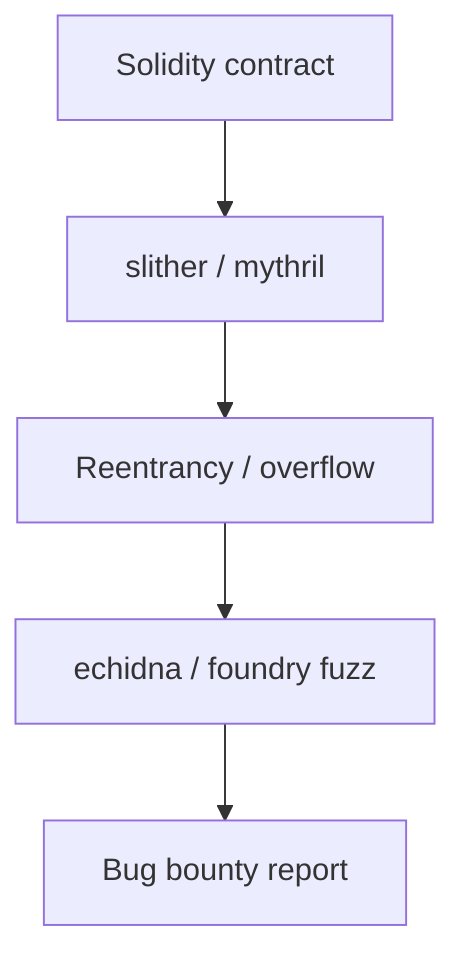
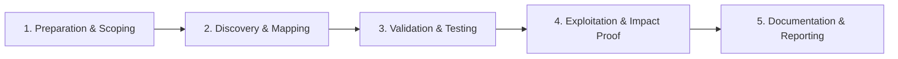

# Smart Contract Auditing

Review Solidity and EVM contracts for common vulnerabilities.

## Overview Diagram

Visual summary of the **attack/data flow** and the **five-phase testing workflow** for this topic.

### Attack / Data Flow

### Testing Workflow

## How It Works

**Smart contracts** are immutable (or upgradeable) programs on blockchains—primarily EVM (Solidity) and Solana (Rust). They hold tokens, enforce DeFi logic, and govern DAOs. Bugs cause direct financial loss with no recourse: reentrancy, integer overflow (pre-0.8), access control failures, oracle manipulation, and flash loan attacks.

Contracts interact via external calls; composability means vulnerabilities chain across protocols.

## Exploitation

1. **Static analysis**: Slither, Mythril for reentrancy, unchecked sends, tx.origin auth.
2. **Manual review**: trace `call`/`delegatecall`, modifier coverage, initialization functions.
3. **Fuzzing**: Echidna property tests (`echidna-test`) for invariant violations.
4. **Foundry/Hardhat tests**: fork mainnet state; simulate attacks with flash loans.
5. **Oracle checks**: spot price from single DEX pool vs Chainlink aggregators.
6. **Upgradeability**: proxy admin keys, uninitialized implementation contracts.

Report via Immunefi or protocol bug bounty; never exploit mainnet without authorization.

## Defense & Mitigation

- Follow **checks-effects-interactions**; use ReentrancyGuard on external calls.
- Use Solidity 0.8+ built-in overflow checks; explicit casting with care.
- **Least privilege**: Ownable/AccessControl on every sensitive function.
- Multi-sig and timelocks for admin operations; monitor with Forta/Tenderly.
- Use audited libraries (OpenZeppelin); minimize custom low-level assembly.
- Independent audits, bug bounties, and gradual rollout with TVL caps.

## Pro Tips

Practical advice from real engagements — use these to test faster and report better.

!!! warning "Fork mainnet locally"
    Foundry `anvil --fork-url` — never test exploits on live chain.

!!! tip "slither first"
    Static analysis catches reentrancy and access control in minutes.

!!! tip "Check upgrade proxy"
    UUPS/Transparent proxy admin key = full drain if compromised.

!!! tip "Invariant fuzzing"
    Echidna `echidna` on protocol invariants — balance never negative.

!!! tip "Immunefi scope"
    Out-of-scope contracts and known issues listed — read first.

## Testing Methodology

Work through each phase in order. Every step has a checkbox — complete them all for thorough, reproducible coverage.

### Phase 1 — Preparation & Scoping

- [ ] Confirm target is in program scope and ROE allows this test type
- [ ] Set up isolated lab or proxy (Burp/ZAP) with scope filters
- [ ] Document baseline application behavior and account roles
- [ ] Identify test accounts for each privilege level
- [ ] Obtain contract address and scope on Immunefi/program

### Phase 2 — Discovery & Mapping

- [ ] Set up Foundry/Hardhat fork of mainnet state
- [ ] Run slither and mythril static analysis
- [ ] Review access control and upgrade patterns
- [ ] Map external calls and reentrancy surfaces

### Phase 3 — Validation & Testing

- [ ] Fuzz with Echidna/Foundry invariant tests
- [ ] Develop PoC exploit on local fork only
- [ ] Calculate funds at risk
- [ ] Never exploit mainnet without authorization

### Phase 4 — Exploitation & Impact Proof

- [ ] Submit report with PoC and recommended fix
- [ ] Follow responsible disclosure timeline

### Phase 5 — Documentation & Reporting

- [ ] Write step-by-step reproduction with HTTP requests/responses
- [ ] Capture screenshots or video showing impact (redact sensitive data)
- [ ] Rate severity using program CVSS or impact matrix
- [ ] Provide concrete remediation guidance for developers
- [ ] Retest after fix if program allows verification

## Tools

| Tool | Usage |
|------|-------|
| `slither` | [Solidity static analyzer](../../TOOLS_GUIDE.md#slither) |
| `mythril` | [EVM bytecode analysis](../../TOOLS_GUIDE.md#mythril) |
| `foundry` | [Smart contract dev & testing](../../TOOLS_GUIDE.md#foundry) |
| `echidna` | [Smart contract fuzzer](../../TOOLS_GUIDE.md#echidna) |

## Resources

- [SWC Registry](https://swcregistry.io/)

## Verification Checklist

- [ ] Review scope and rules of engagement
- [ ] Document baseline behavior
- [ ] Test edge cases and parser differentials
- [ ] Capture proof-of-concept safely
- [ ] Write remediation guidance
