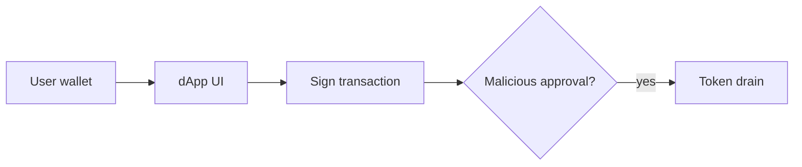
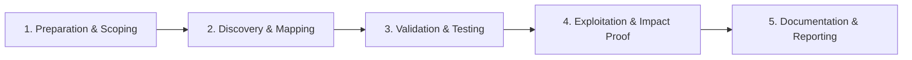

# Wallet & dApp Security

Test wallet connectors and decentralized application frontends.

## Overview Diagram

Visual summary of the **attack/data flow** and the **five-phase testing workflow** for this topic.

### Attack / Data Flow

### Testing Workflow

## How It Works

**Wallets** (MetaMask, Rabby, hardware wallets) sign transactions and messages. **dApp frontends** request signatures via `eth_sendTransaction` or `personal_sign`. Users often approve malicious **token approvals**, **permit signatures**, or transactions to attacker contracts without reading hex calldata.

Frontend compromises (DNS hijack, CDN supply chain) replace contract addresses. Phishing sites mimic legitimate dApps with infinite approval prompts.

## Exploitation

1. **Review signing UX**: does the wallet show decoded function names and spender addresses?
2. **Approval audit**: check `approve`/`permit` for unlimited allowances to unknown contracts.
3. **Frontend review**: CSP, SRI on scripts, wallet connect domain binding.
4. **Chain ID**: test if dApp validates chainId prevents cross-chain replay confusion.
5. **Address poisoning**: verify UI highlights matching characters in recipient addresses.
6. **Simulate**: Tenderly or wallet dev mode to preview transaction effects before sign.

Bug bounty focus: phishing via dApp UI, not unauthorized mainnet theft.

## Defense & Mitigation

- Display **human-readable** transaction previews; warn on unlimited approvals.
- Hardcode or allowlist contract addresses; verify on multiple channels.
- Strong **CSP**, Subresource Integrity, and integrity monitoring on frontend hosting.
- Educate users on approval hygiene; integrate revoke.cash-style tooling.
- Wallet vendors: clear signing screens, domain binding in EIP-712 messages.
- Monitor deployed frontend hashes; alert on deploy changes.

## Testing Methodology

Work through each phase in order. Every step has a checkbox — complete them all for thorough, reproducible coverage.

### Phase 1 — Preparation & Scoping

- [ ] Confirm target is in program scope and ROE allows this test type
- [ ] Set up isolated lab or proxy (Burp/ZAP) with scope filters
- [ ] Document baseline application behavior and account roles
- [ ] Identify test accounts for each privilege level
- [ ] Identify dApp frontend and connected contracts

### Phase 2 — Discovery & Mapping

- [ ] Review wallet connect and transaction prompts
- [ ] Test for malicious approval requests
- [ ] Analyze JS for private key handling
- [ ] Simulate transactions on testnet/fork

### Phase 3 — Validation & Testing

- [ ] Demonstrate UI deception (wrong address, amount)
- [ ] Test phishing via cloned dApp domain
- [ ] Validate transaction simulation warnings
- [ ] Document user flow vulnerabilities

### Phase 4 — Exploitation & Impact Proof

- [ ] Report UI/UX security issues to project
- [ ] Recommend clear signing prompts and domain verification

### Phase 5 — Documentation & Reporting

- [ ] Write step-by-step reproduction with HTTP requests/responses
- [ ] Capture screenshots or video showing impact (redact sensitive data)
- [ ] Rate severity using program CVSS or impact matrix
- [ ] Provide concrete remediation guidance for developers
- [ ] Retest after fix if program allows verification

## Tools

| Tool | Usage |
|------|-------|
| `burp` | [Intercept, repeater & scanner](../../TOOLS_GUIDE.md#burp-suite) |
| `wallet simulators` | [Test dApp flows in local EVM simulators](../../TOOLS_GUIDE.md) |

## Verification Checklist

- [ ] Review scope and rules of engagement
- [ ] Document baseline behavior
- [ ] Test edge cases and parser differentials
- [ ] Capture proof-of-concept safely
- [ ] Write remediation guidance
